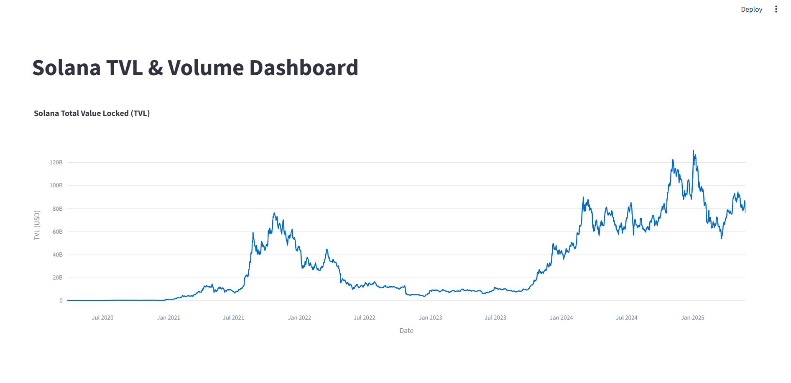

# 🚀 DeFi Metrics Dashboard

<div align="center">



**A comprehensive DeFi analytics platform for Solana network metrics**

[](https://python.org)
[](https://streamlit.io)
[](https://supabase.com)
[](LICENSE)

</div>

## 📊 Overview

DeFi Metrics Dashboard is a powerful analytics platform that provides real-time insights into Solana's decentralized finance ecosystem. Built with Streamlit and powered by Supabase, it offers comprehensive visualization of Total Value Locked (TVL), trading volumes, and market cap trends.

### ✨ Key Features

- 📈 **Real-time TVL Tracking** - Monitor Solana's Total Value Locked with interactive charts
- 💹 **Volume Analysis** - Track trading volumes and market activity
- 📊 **Interactive Dashboards** - Beautiful, responsive visualizations powered by Plotly
- 🗄️ **Robust Data Pipeline** - ETL processes for reliable data ingestion
- 🔄 **Automated Updates** - Fresh data from Kaggle and external sources
- 🎨 **Modern UI** - Clean, professional interface built with Streamlit

## 🏗️ Architecture

```
┌─────────────────┐    ┌─────────────────┐    ┌─────────────────┐
│   Data Sources  │───▶│   ETL Pipeline  │───▶│   Supabase DB   │
│   • Kaggle      │    │   • Transform   │    │   • PostgreSQL  │
│   • APIs        │    │   • Validate    │    │   • Real-time   │
└─────────────────┘    └─────────────────┘    └─────────────────┘
                                                       │
                                                       ▼
                                               ┌─────────────────┐
                                               │ Streamlit App  │
                                               │ • Dashboard     │
                                               │ • Visualizations│
                                               │ • Analytics     │
                                               └─────────────────┘
```

## 🚀 Quick Start

### Prerequisites

- Python 3.8 or higher
- Supabase account and project
- Kaggle account (for data access)

### Installation

1. **Clone the repository**
   ```bash
   git clone https://github.com/yourusername/defi-metrics.git
   cd defi-metrics
   ```

2. **Create virtual environment**
   ```bash
   python -m venv venv
   source venv/bin/activate  # On Windows: venv\Scripts\activate
   ```

3. **Install dependencies**
   ```bash
   pip install -r requirements.txt
   ```

4. **Environment Setup**
   ```bash
   cp .env.example .env
   ```
   
   Fill in your environment variables:
   ```env
   # Supabase Configuration
   DB_USER=your_supabase_user
   DB_PASSWORD=your_supabase_password
   DB_HOST=your_supabase_host
   DB_PORT=5432
   DB_NAME=postgres
   
   # Optional: Kaggle API
   KAGGLE_USERNAME=your_kaggle_username
   KAGGLE_KEY=your_kaggle_key
   ```

5. **Run the application**
   ```bash
   streamlit run my_dataset/dashboard.py
   ```

## 📁 Project Structure

```
defi-metrics/
├── 📊 my_dataset/              # Main application code
│   ├── dashboard.py           # Streamlit dashboard
│   ├── basic_analysis.py      # Data analysis scripts
│   ├── etl_load_to_supabase.py # ETL pipeline
│   ├── connection_test.py     # Database utilities
│   └── my_data.py            # Data extraction
├── 🗄️ supabase/               # Database configuration
│   └── config.toml           # Supabase settings
├── 📋 requirements.txt        # Python dependencies
├── 🔧 .gitignore             # Git ignore rules
└── 📖 README.md              # This file
```

## 🛠️ Usage

### Running the Dashboard

```bash
# Start the Streamlit dashboard
streamlit run my_dataset/dashboard.py

# The dashboard will be available at:
# http://localhost:8501
```

### Data Pipeline

```bash
# Run ETL process to load data
python my_dataset/etl_load_to_supabase.py

# Test database connection
python my_dataset/connection_test.py
```

### Data Analysis

```bash
# Run basic analysis
python my_dataset/basic_analysis.py
```

## 📊 Dashboard Features

### TVL Visualization
- **Interactive Line Charts** - Zoom, pan, and hover for detailed insights
- **Time Range Selection** - Focus on specific periods
- **Responsive Design** - Works on desktop and mobile

### Data Metrics
- **Market Cap Trends** - Track Solana's market capitalization
- **Volume Analysis** - Monitor trading activity
- **Price Movements** - OHLC data visualization

## 📈 Data Sources

- **Kaggle**: Solana historical data
- **Supabase**: Real-time database storage
- **External APIs**: Future integrations planned

---

<div align="center">

**⭐ Star this repository if you found it helpful!**

Made with ❤️ for the DeFi community

</div>

